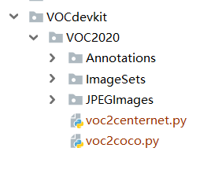

# 1.setup
* conda create -n Centernet python==3.8
* pip install torch==1.13.1+cu117 torchvision==0.14.1+cu117 torchaudio==0.13.1 --extra-index-url https://download.pytorch.org/whl/cu117
* pip install opencv-python==4.8.0.74
* pip install PyWavelets==1.4.1
* conda install matplotlib

# 2.prepare dataset

Please download the <a href ="https://drive.google.com/file/d/1QMtD2NGD02hkylJ2hQB0x5JjKtursx4O/view?usp=drive_link">IMO dataset</a> and extract it to the designated directory.

Directory structure:

# 3.prepare model weights

Download the weights for diff. models in the paper, CNet refers to CenterNet, while WNet refers to CenterNet optimized with wavelet decomposition:

<table id="table1">
<tr>
<td>N</td>
<td>Model</td>
<td>Weights</td>
</tr>
<tr>
<td rowspan="2">512</td>
<td>CNet</td>
<td><a href="https://drive.google.com/file/d/1oHSXN8xyaEvMSumZK2l2De7odXUR1QDg/view?usp=drive_link">Centernet_512.pth</a></td>
</tr>
<tr>
<td>WNet</td>
<td><a href="https://drive.google.com/file/d/1V2SddvfayJOnbqwaGb5tk46sLJ9X1o77/view?usp=drive_link">CenterNet_Wav_512.pth</a></td>
</tr>
<tr>
<td rowspan="2">640</td>
<td>CNet</td>
<td><a href="https://drive.google.com/file/d/14oR-u-2HaMo2s4n5h8LElAYDYv4KJiws/view?usp=drive_link">Centernet_640.pth</a></td>
</tr>
<tr>
<td>WNet</td>
<td><a href="https://drive.google.com/file/d/1pPnlxtIWj0POb-ZfL1KBg3gZ5KEK8odn/view?usp=drive_link">CenterNet_Wav_640.pth</a></td>
</tr>
<tr>
<td rowspan="2">768</td>
<td>CNet</td>
<td><a href="https://drive.google.com/file/d/1uTd5KG-M84pM7p-eCkHN54q2n3IkJDNj/view?usp=drive_link">Centernet_768.pth</a></td>
</tr>
<tr>
<td>WNet</td>
<td><a href="https://drive.google.com/file/d/1TldBXWe7NNtuYZ3MK4tWeDU_f8SQZxvI/view?usp=drive_link">CenterNet_Wav_768.pth</a></td>
</tr>
</table>

Additionally, the weight file <a href="https://drive.google.com/file/d/1H9PRxYhp2UXEY6G6IejgoaE_DEJQs1nx/view?usp=drive_link">centernet_512_voc.pth</a> trained on the VOC2007 dataset in Figure 1 of our paper is available. Simply place these weight files in the directory 'model_data'.

# 4.execute locally

4.1Train the models:

*Centernet_512.pth:

      python train.py --surfix 512 --fep 150 --ufep 300
      
      python train.py --surfix 512 --fep 50 --ufep 100
      
      python train.py --surfix 512 --fep 50 --ufep 100

*Centernet_640.pth:

      python train.py --surfix 640--fep 150 --ufep 300
      
      python train.py --surfix 640--fep 50 --ufep 100
      
      python train.py --surfix 640--fep 50 --ufep 100

*Centernet_768.pth:

      python train.py --surfix 768--fep 150 --ufep 300
      
      python train.py --surfix 768--fep 50 --ufep 100
      
      python train.py --surfix 768--fep 50 --ufep 100
      
      python train.py --surfix 768--fep 50 --ufep 100

*CenterNet_Wav_512.pth:

      python train.py --surfix 512--fep 150 --ufep 300
      
      python train.py --surfix 512--fep 50 --ufep 100
      
      python train.py --surfix 512--fep 50 --ufep 100

*CenterNet_Wav_640.pth:

      python train.py --surfix 640--fep 150 --ufep 300
      
      python train.py --surfix 640--fep 50 --ufep 100
      
      python train.py --surfix 640--fep 50 --ufep 100

*CenterNet_Wav_768.pth:

      python train.py --surfix 768--fep 150 --ufep 300
      
      python train.py --surfix 768--fep 50 --ufep 100
      
      python train.py --surfix 768--fep 50 --ufep 100

4.2Evaluation

* Centernet_512.pth:

    python mAP.py model_data/Centernet_512.pth 512  

* Centernet_640.pth:

    python mAP.py model_data/Centernet_640.pth 640

* Centernet_768.pth:

    python mAP.py model_data/Centernet_768.pth 768

* CenterNet_Wav_512.pth:

    python mAP.py model_data/CenterNet_Wav_512.pth 512

* CenterNet_Wav_640.pth:

    python mAP.py model_data/CenterNet_Wav_640.pth 640

*CenterNet_Wav_768.pth:

    python mAP.py model_data/CenterNet_Wav_768.pth 768
